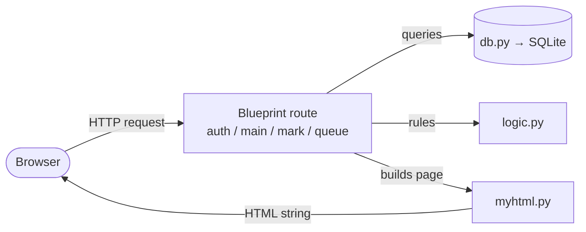
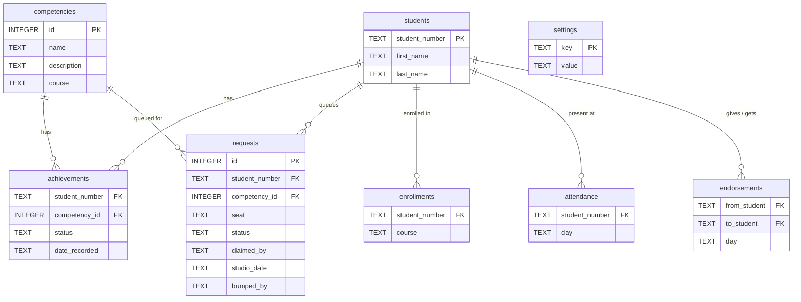

# Competencies App

A Flask web app for a competency-based studio at TMU (Fall 2026) that runs two
first-year courses together: **CPS109** (Python) and **CPS213** (digital logic).
There are no lectures, assignments, or exams. Instead, students demonstrate
competencies one-on-one to a TA in the lab, and the app coordinates that: students
sign up for what they are ready to show, TAs work a live queue, and results are
recorded in real time.

Each course has 40 competencies, and a few simple rules keep the studio fair and
moving.

## What it does

- **Live evaluation queue.** Students sign up for the competencies they are ready to
  show and take a seat when they arrive. TAs work the waiting list, claim a student,
  and mark each competency **Achieved**, **Not passed**, or **Not assessed** on the
  spot, one tap.
- **Balanced progress across both courses.** Each session a student can sign up for a
  few competencies (a cap), kept balanced between CPS109 and CPS213 so nobody races
  ahead in one course and neglects the other.
- **Carried-over competencies.** If a TA is not the right person to evaluate
  something, they tap **"Can't evaluate"** and it carries over to the student's next
  session instead of being lost or counted as a fail.
- **Studio sessions with book-ahead.** The studio meets Tuesday, Wednesday, and
  Thursday. A student can sign up for today's session or book a future one.
- **Attendance.** Students check in each session, and staff get a per-student
  attendance view.
- **Peer shout-outs.** A student can thank a classmate who helped them, and staff see
  a tally.
- **Per-course enrollment.** Students only see and sign up for the courses they are
  actually enrolled in.

## Why it's solid

- **~100 automated tests** cover the queue, the sign-up rules, attendance,
  shout-outs, enrollment, and the sign-in guards. They run in about a second
  (`python -m pytest tests/`).
- **The trickiest part is handled safely:** two TAs can tap the same student at the
  same moment, and only one ever gets them, so no two TAs walk to the same seat. It is
  covered by tests.
- **Every feature ships through a pull-request review** before merging, and an
  independent code review of the latest features came back with only minor issues, no
  real bugs.

## Quick start

**First-time setup** (clone, then from the repo root):

```
python3 -m venv venv              # create the virtualenv
source venv/bin/activate          # activate it (every new shell)
pip install -r requirements.txt   # install Flask
sqlite3 course-data.db < schema.sql   # build the database structure
sqlite3 course-data.db < seed.sql     # load sample students + competencies
```

**Run the app** (the day-to-day command):

```
source venv/bin/activate
flask --app app run --debug --port 8080
```

Open `http://127.0.0.1:8080/`. `--debug` gives auto-reload and full error pages.
Port 8080 avoids the macOS AirPlay conflict on 5000. The database is a file
(`course-data.db`) and persists between restarts; you only re-run the two
`sqlite3` commands to wipe and rebuild it (e.g. after a schema change).

**Dev logins.** There is no password in development (CAS replaces this later) —
on `/login`, type one of the seeded usernames:

| Type this | Signs in as |
|-----------|-------------|
| `dmason` | staff (lands on the evaluation queue) |
| `lfortune` | staff. Sign in as a *second* TA in a private window to watch queue claiming: a student claimed by `dmason` disappears from `lfortune`'s queue. |
| `600990517` | student Priya Singh |
| `500880917` | student Sarah Hassan |
| `500111111` | student Alice Chen |
| `500222222` | student Ben Okafor |
| `500333333` | student Chloe Diaz |

**Run the tests.** From the repo root with the venv active:

```
python -m pytest tests/
```

## How it's built

Python / Flask backend, SQLite database. The code is split by responsibility so
each file has one clear job:

| File | Responsibility |
|------|----------------|
| `app.py` | `create_app()` app factory: builds the app and registers the blueprints. |
| `blueprints/auth.py` | sign in / sign out. |
| `blueprints/main.py` | roster home and student progress pages. |
| `blueprints/mark.py` | staff marking page and per-tap save. |
| `blueprints/queue.py` | the evaluation queue (sign-up + staff marking). |
| `common.py` | helpers shared across blueprints (current user, page header). |
| `logic.py` | pure rules: competency states, the retry cooldown, studio sessions, and the balance rule. No Flask/DB/HTML. |
| `db.py` | all data access: the `db.cursor()` context manager and every query. |
| `myhtml.py` | HTML elements as Python classes; `str()` renders the markup. |

A request flows: a **blueprint route** asks **`db.py`** for data and **`logic.py`**
for rule answers, builds the page with **`myhtml.py`**, and returns the HTML.



**Production:** runs under Apache via `mod_wsgi` with TMU CAS login. In development
the login is a simple dev placeholder, so no Apache, CAS, or VPN is needed.

## Data model

Schema and seed data live in `schema.sql` and `seed.sql`.



- **`students`, `competencies`** — the people, and the 40-per-course competencies.
- **`achievements`** — one row per recorded result (Achieved or Not passed). No row
  means "not assessed."
- **`requests`** — the evaluation queue: one row per competency a student asks to be
  evaluated on, flowing `waiting` → `claimed` → `done`.
- **`enrollments`, `attendance`, `endorsements`** — who takes which course, who showed
  up, and peer thank-yous.
- **`settings`** — config such as the admin usernames and the per-session cap.
