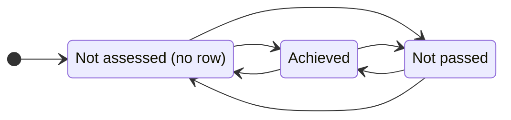
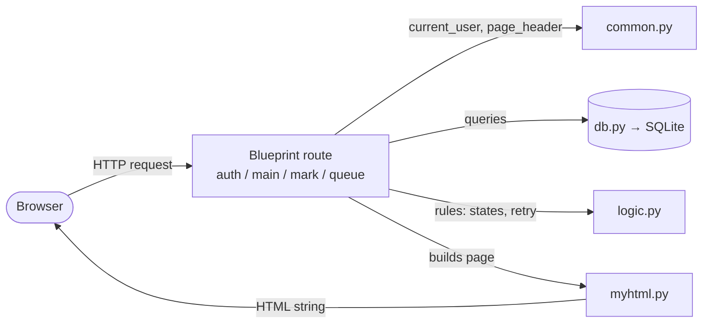
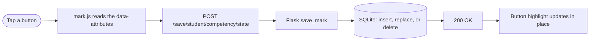
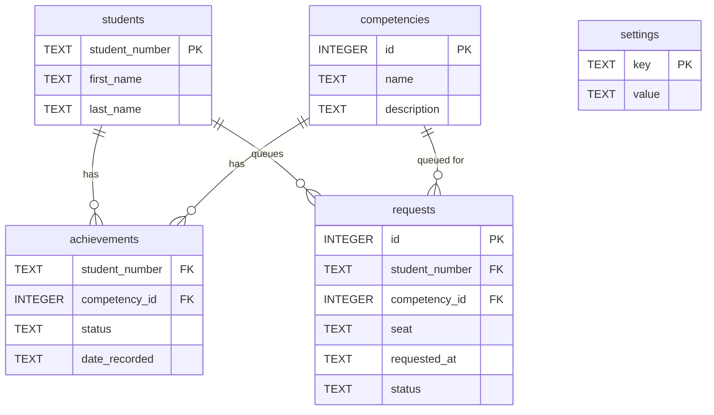

# Competencies App

A Flask web app for tracking student competencies for the CPS109 Python programming course at TMU in Fall 2026.
Students demonstrate competencies in lab; instructors and TAs record them in real time. No lectures, assignments, or exams.

## Quick start

**First-time setup** (clone, then from the repo root):

```
python3 -m venv venv              # create the virtualenv
source venv/bin/activate          # activate it (every new shell)
pip install -r requirements.txt   # install Flask
sqlite3 course-data.db < schema.sql   # build the database structure
sqlite3 course-data.db < seed.sql     # load sample students + competencies
```

**Run the app** (the day-to-day command):

```
source venv/bin/activate
flask --app app run --debug --port 8080
```

Open `http://127.0.0.1:8080/`. `--debug` gives auto-reload and full error pages.
Port 8080 avoids the macOS AirPlay conflict on 5000. The database is a file
(`course-data.db`) and persists between restarts; you only re-run the two
`sqlite3` commands to wipe and rebuild it (e.g. after a schema change).

**Dev logins.** There is no password in development (CAS replaces this later) —
on `/login`, type one of the seeded usernames:

| Type this | Signs in as |
|-----------|-------------|
| `dmason` | staff (lands on the evaluation queue) |
| `600990517` | student Priya Singh |
| `500880917` | student Sarah Hassan |

## What it does

After signing in (`/login`), staff land on the evaluation queue and students on
their own progress page. The main pages:

- **Home** (`/`): roster of students, each linking to mark or view them.
- **Staff view** (`/mark/<student_number>`): three buttons per competency (Not
  assessed / Achieved / Not passed). One tap sets the state and saves, no save
  button. Any TA or instructor can mark any student.
- **Student view** (`/view/<student_number>`): read-only progress, each
  competency shown as a colored status pill.
- **Evaluation queue** (`/queue`): the lab coordination layer.
  - *Students* sign up for the competencies they want evaluated today and enter
    their seat number; they can cancel their own requests. Only competencies they
    can actually attempt appear (not assessed, or past their retry window), capped
    at a configurable number of requests per day.
  - *Staff* see one card per waiting student (name, seat, their requested
    competencies), longest-waiting first. Each competency has Achieved / Not
    passed buttons that record the result and clear it from the queue in one tap,
    so a TA can mark students while moving around the room.

## Competency states

Each competency is in one of three states per student: **Not assessed** (no record
yet), **Achieved**, or **Not passed** (attempted, did not pass, then a cooldown
before retrying). Staff mark the third one "Not passed"; the student view shows it
as "Available to retry" with the time remaining.



This cooldown spaces out re-attempts. The rule (decided June 15): a "Not passed"
competency unlocks **two calendar days later at 8 AM Toronto time** (a Tuesday fail
unlocks Thursday 8 AM). Only the date of the attempt matters, not the hour. The
stored UTC timestamp is converted to `America/Toronto` first, so 8 AM is local and
the EST/EDT switch is handled automatically. The student view shows "Available to
retry &lt;day&gt; 8 AM", computed live from `date_recorded`. It is display only:
nothing yet blocks an early re-attempt during the window (whether to enforce that
is pending Dave's call, issue #1).

## Architecture

Python / Flask backend, SQLite database. The code is split by responsibility so
each file has one reason to change:

| File | Responsibility |
|------|----------------|
| `app.py` | `create_app()` app factory: builds the app and registers the blueprints. |
| `blueprints/auth.py` | sign in / sign out (`/login`, `/logout`). |
| `blueprints/main.py` | roster home (`/`) and student progress (`/view/...`). |
| `blueprints/mark.py` | staff marking page (`/mark/...`) and per-tap save. |
| `blueprints/queue.py` | the evaluation queue (sign-up + staff marking). |
| `common.py` | helpers shared across blueprints: `current_user`, `userCas`, `page_header`. |
| `logic.py` | pure rules: states, the retry/cooldown math, timestamp parsing. No Flask/DB/HTML. |
| `db.py` | data access: the `db.cursor()` context manager plus settings/role lookups. |
| `myhtml.py` | HTML elements as Python classes; `str()` recurses to emit markup. |

- **Blueprints** group related routes into their own module, then get registered
  onto the app in `create_app()`. A route's endpoint name is prefixed by its
  blueprint, so links use `url_for('queue.queue')`, `url_for('main.index')`, etc.
- A request flows: **route** (a blueprint) → asks **`db.py`** for data and
  **`logic.py`** for rule answers → builds a page with **`myhtml.py`** → returns
  the HTML string.


- **Production:** runs under Apache via `mod_wsgi`, with TMU CAS auth
  (`mod_auth_cas` sets a `Cas-User` header). In development the CAS user is
  hardcoded, so no Apache, CAS, or VPN is needed.

### Tap-to-save flow



The button changes color only after the save succeeds, so the screen always
matches the database.

## Data model

Schema and seed data live in `schema.sql` and `seed.sql`.



A row in `achievements` exists only for a recorded event; `status` is
`'achieved'` or `'cooling_off'`, and "not assessed" is the *absence* of a row
(derived at read time). `date_recorded` is a full timestamp, so the cooldown is a
single elapsed-time comparison. The composite primary key is (`student_number`,
`competency_id`). `settings` holds config such as admin usernames and the daily
request cap.

`requests` is the evaluation queue: one row per competency a student asks to be
evaluated on. `status` is `'waiting'` until a TA records the result, which writes
to `achievements` and flips the request to `'done'` in one step.
