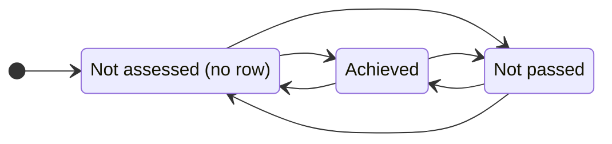
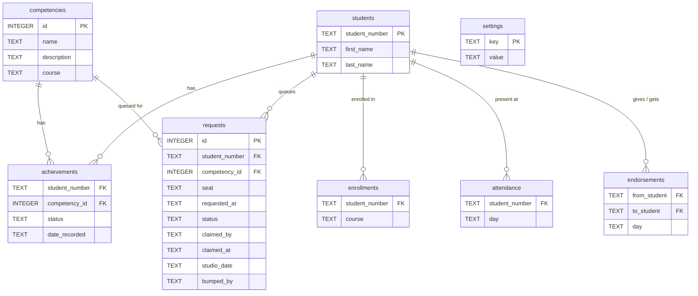

# Competencies App

A Flask web app for a competency-based studio at TMU (Fall 2026) that runs two
first-year courses together: **CPS109** (Python) and **CPS213** (digital logic).
There are no lectures, assignments, or exams. Instead, students demonstrate
competencies one-on-one to a TA in the lab, and the app coordinates that: students
sign up for what they are ready to show, TAs work a live queue, and results are
recorded in real time.

Each course has 40 competencies. A few rules keep the studio fair and moving:
students may request only a few per session (a cap), must keep progress on both
courses roughly balanced (the [balance rule](#the-balance-rule)), and a competency
a TA cannot get to is carried over rather than lost (see
[deferred competencies](#deferred-carried-over-competencies)).

## Quick start

**First-time setup** (clone, then from the repo root):

```
python3 -m venv venv              # create the virtualenv
source venv/bin/activate          # activate it (every new shell)
pip install -r requirements.txt   # install Flask
sqlite3 course-data.db < schema.sql   # build the database structure
sqlite3 course-data.db < seed.sql     # load sample students + competencies
```

**Run the app** (the day-to-day command):

```
source venv/bin/activate
flask --app app run --debug --port 8080
```

Open `http://127.0.0.1:8080/`. `--debug` gives auto-reload and full error pages.
Port 8080 avoids the macOS AirPlay conflict on 5000. The database is a file
(`course-data.db`) and persists between restarts; you only re-run the two
`sqlite3` commands to wipe and rebuild it (e.g. after a schema change).

**Dev logins.** There is no password in development (CAS replaces this later) —
on `/login`, type one of the seeded usernames:

| Type this | Signs in as |
|-----------|-------------|
| `dmason` | staff (lands on the evaluation queue) |
| `lfortune` | staff. Sign in as a *second* TA in a private window to watch queue claiming: a student claimed by `dmason` disappears from `lfortune`'s queue. |
| `600990517` | student Priya Singh |
| `500880917` | student Sarah Hassan |
| `500111111` | student Alice Chen |
| `500222222` | student Ben Okafor |
| `500333333` | student Chloe Diaz |

Sign several students up for the same competency to see the by-competency cohort
view do something interesting.

## What it does

After signing in (`/login`), staff land on the evaluation queue and students on
their own progress page. The main pages:

- **Home** (`/`): roster of students, each linking to mark or view them.
- **Staff view** (`/mark/<student_number>`): three buttons per competency (Not
  assessed / Achieved / Not passed). One tap sets the state and saves, no save
  button. Any TA or instructor can mark any student.
- **Student view** (`/view/<student_number>`): read-only progress, each
  competency shown as a colored status pill.
- **Evaluation queue** (`/queue`): the lab coordination layer.
  - *Students* sign up for the competencies they want evaluated today; they can
    cancel their own requests. Only competencies they can actually attempt appear
    (not assessed, or past their retry window), and only from their enrolled
    courses. Sign-ups are limited per studio session and kept balanced across the
    two courses (see [The balance rule](#the-balance-rule)).

    Sign-up asks for **no seat number**, because students sign up before they get
    to the lab (from home, on the way in) and seats are not assigned: you take
    whichever machine is free. They enter a seat once they are actually sitting
    down, and **that is what makes them visible to staff**. A request with no seat
    is a plan, not a person a TA can walk over to, so the staff queue does not list
    it. Leaving the lab clears the seat, which drops them off the staff queue
    without cancelling what they signed up for.
  - *Staff* see the waiting students, longest-waiting first, in one of two
    groupings (toggle at the top of the queue):
    - **By student** (`/queue?group=student`): one card per student, listing the
      competencies they asked for. Tapping the card **claims** them and opens
      their evaluation screen (`/queue/student/<student_number>`), which lists
      only what they requested, each with Achieved / Not passed.
    - **By competency** (`/queue?group=competency`): one card per competency,
      listing everyone waiting on it. Tapping it claims the whole cohort and
      opens `/queue/competency/<id>`, where the TA marks each student on that
      one competency. This is a **TA worklist, not a group session**: the point
      is that marking a cohort back to back applies one consistent standard,
      rather than the bar drifting as you jump between competencies. (If students
      gathered to be evaluated together they could copy the previous answer.)
  - Marking records the result and clears the request in one tap, with a one-shot
    **Undo**. A TA can also **Release** a student (or cohort) back to the queue.

### Queue claiming

Two TAs must never walk over to the same student. Selecting a student *claims*
them: their requests flip to `claimed` by that TA and they vanish from every other
TA's queue.

The claim is a single conditional `UPDATE`, and the affected row count decides the
winner (`db.claim_student`):

```sql
update requests
   set status = 'claimed', claimed_by = ?, claimed_at = CURRENT_TIMESTAMP
 where student_number = ?
   and (seat is not null and seat != ''
        and (status = 'waiting'
             or (status = 'claimed' and claimed_at < datetime('now', ?))));
```

`rowcount > 0` → the student is yours. `rowcount == 0` → another TA got there
first, because *their* write is what made the condition false for you. That is
**optimistic concurrency control**: there is no explicit lock, the `WHERE` clause
*is* the lock.

A `SELECT`-then-`UPDATE` would be broken here. Both TAs would read `'waiting'`,
both would pass the check, and both would write, with the second silently
overwriting the first. The check and the write have to be one statement so nothing
can interleave between them.

**Claiming takes the whole student**, not just one of their requests. A student can
only talk to one TA at a time, so handing the same student to two TAs (one per
competency) would move the collision out of the queue and into the room. The
visible cost: if Alice wants Recursion *and* Nested loops, and a TA takes the
Recursion cohort, Alice drops out of the Nested loops cohort until that TA is done
with her. Cohorts can look smaller than expected.

**Stale claims.** A TA who claims a student and then closes their laptop would
otherwise strand that student where no TA can see them. A claim older than
`claim_timeout_minutes` (a `settings` row, default 20) counts as available again.
This is evaluated at read time, in the same `db.AVAILABLE` predicate used to list
the queue and to guard the claim, so there is no sweeper job and the two can never
disagree about who is free.

**Undo** returns a request to `claimed` *by the same TA*, not to `waiting`. A
mis-tap while standing at the student's desk should not fling them back into the
global queue for someone else to pick up.

That `seat is not null` at the top of the predicate is the "is the student actually
here?" check (see above). It lives in `db.AVAILABLE`, which is used both to list the
queue and to guard the claim, so the two can never disagree about who is free. A
student who has not sat down cannot be listed *or* claimed, and a TA never walks
over to an empty chair.

## Studio sessions and advance scheduling

The studio meets three times a week (Tuesday, Wednesday, Thursday). A sign-up is
for a specific **studio session**, not just "today": a student can book ahead, and
each request carries the `studio_date` it is for. The staff queue defaults to
today's live, claimable session; a TA can switch to a future day to see a read-only
**planning roster** of who has booked it. Studio days come from the weekly pattern
in `logic.py` (no term calendar yet).

## The balance rule

Each session, a student may sign up for at most a few competencies (the cap,
default **3**, a `settings` value Dave can change without touching code), and their
two courses must stay **within 1 of each other**: 2 of one course and 1 of the
other is fine, but 3 and 0 is not. This keeps students moving through both CPS109
and CPS213 rather than bingeing one. A sign-up that breaks the cap or the balance is
**rejected whole**, with a message explaining why. The rule is a pure function
(`logic.session_signup_ok`) checked against the session's per-course tally
(`db.session_course_counts`) in `queue_join`.

## Deferred, carried-over competencies

A TA who is not prepared to evaluate a competency taps **"Can't evaluate"** on it.
Rather than failing the student, the competency is *bumped*: it returns to the queue
tagged with the TA who bumped it (`bumped_by`). Three things follow:

- The by-student queue **flags a student that TA previously bumped**, so they can
  pick it back up once prepped, or steer clear.
- The bumped competency **waits for the student**: when they next take a seat it
  follows them to that session (`db.carry_bumped_forward`), so it is never stranded
  on a day they do not return.
- It **does not count against the student's cap or balance**, and the student sees
  it as "carried over", not failed.

## Attendance

Students check in each session ("I'm here today"), recorded in `attendance`
(`student_number`, `day`); taking a seat marks attendance too. Staff get an
attendance view (sessions attended per student) for the instructor's
miss-more-than-half rule. Check-ins only count on real class days.

## Peer shout-outs

A student can thank a classmate who helped them, from a dropdown on their own
progress page (`endorsements`). Staff see a received-count tally the instructor
folds into course remarks. One thank-you per classmate per day, enforced by the
table's primary key.

## Per-course enrollment

`enrollments` links a student to the courses they take, and students only see and
sign up for their enrolled courses' competencies. Most first-years take both
courses; a part-time student in one course sees only that one.

## Competency states

Each competency is in one of three states per student: **Not assessed** (no record
yet), **Achieved**, or **Not passed** (attempted, did not pass, then a cooldown
before retrying). Staff mark the third one "Not passed"; the student view shows it
as "Available to retry" with the time remaining.



This cooldown spaces out re-attempts. The rule (decided June 15): a "Not passed"
competency unlocks **two calendar days later at 8 AM Toronto time** (a Tuesday fail
unlocks Thursday 8 AM). Only the date of the attempt matters, not the hour. The
stored UTC timestamp is converted to `America/Toronto` first, so 8 AM is local and
the EST/EDT switch is handled automatically. The student view shows "Available to
retry &lt;day&gt; 8 AM", computed live from `date_recorded`. It is display only:
nothing yet blocks an early re-attempt during the window (whether to enforce that
is pending Dave's call, issue #1).

## Architecture

Python / Flask backend, SQLite database. The code is split by responsibility so
each file has one reason to change:

| File | Responsibility |
|------|----------------|
| `app.py` | `create_app()` app factory: builds the app and registers the blueprints. |
| `blueprints/auth.py` | sign in / sign out (`/login`, `/logout`). |
| `blueprints/main.py` | roster home (`/`) and student progress (`/view/...`). |
| `blueprints/mark.py` | staff marking page (`/mark/...`) and per-tap save. |
| `blueprints/queue.py` | the evaluation queue (sign-up + staff marking). |
| `common.py` | helpers shared across blueprints: `current_user`, `userCas`, `page_header`. |
| `logic.py` | pure rules: states, the retry/cooldown math, timestamp parsing. No Flask/DB/HTML. |
| `db.py` | data access: the `db.cursor()` context manager plus settings/role lookups. |
| `myhtml.py` | HTML elements as Python classes; `str()` recurses to emit markup. |

- **Blueprints** group related routes into their own module, then get registered
  onto the app in `create_app()`. A route's endpoint name is prefixed by its
  blueprint, so links use `url_for('queue.queue')`, `url_for('main.index')`, etc.
- A request flows: **route** (a blueprint) → asks **`db.py`** for data and
  **`logic.py`** for rule answers → builds a page with **`myhtml.py`** → returns
  the HTML string.


- **Production:** runs under Apache via `mod_wsgi`, with TMU CAS auth
  (`mod_auth_cas` sets a `Cas-User` header). In development the CAS user is
  hardcoded, so no Apache, CAS, or VPN is needed.

### Tap-to-save flow


The button changes color only after the save succeeds, so the screen always
matches the database.

## Data model

Schema and seed data live in `schema.sql` and `seed.sql`.



A row in `achievements` exists only for a recorded event; `status` is
`'achieved'` or `'cooling_off'`, and "not assessed" is the *absence* of a row
(derived at read time). `date_recorded` is a full timestamp, so the cooldown is a
single elapsed-time comparison. The composite primary key is (`student_number`,
`competency_id`). `settings` holds config such as admin usernames and the daily
request cap.

`requests` is the evaluation queue: one row per competency a student asks to be
evaluated on. `status` flows `'waiting'` → `'claimed'` → `'done'`:

| status | meaning |
|--------|---------|
| `waiting` | nobody has taken this student yet; shows in every TA's queue |
| `claimed` | a TA has taken them and is walking over. `claimed_by` is that TA, `claimed_at` is when. Hidden from every other TA's queue, and treated as `waiting` again once older than `claim_timeout_minutes`. |
| `done` | evaluated. The result is written to `achievements` and the request flipped, in one step. |

See [Queue claiming](#queue-claiming) for how a claim is made race-safe.
