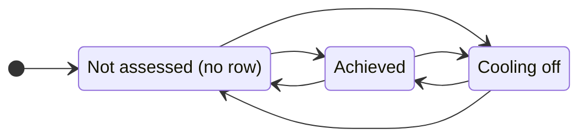
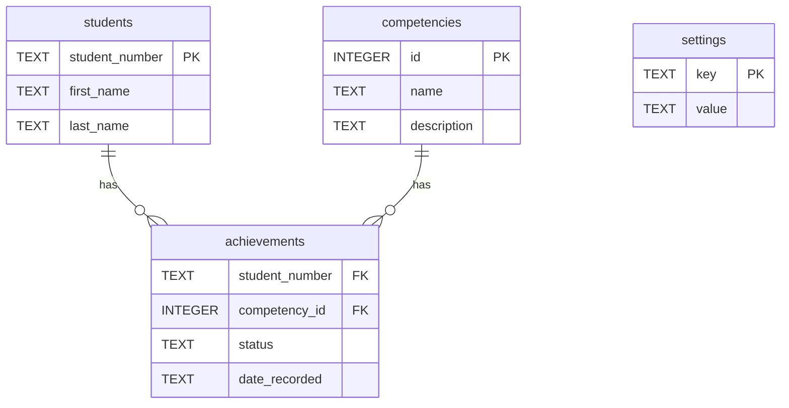

# Competencies App

A web app for tracking student competencies in a competency-based course. The
course has no lectures, assignments, exams, or formal labs: students demonstrate
competencies in lab, and instructors or TAs record them in real time.

## What it does

The course defines a set of competencies (roughly 40). Each student works
toward demonstrating them, and staff record progress as it happens. The app has
a home page and two per-student views:

- **Home** (`/`): a roster of students, each with a link to mark them or to view
  their progress. Every page has a header that links back home.
- **Student view** (`/view/<student_number>`): a read-only progress dashboard.
  Shows every competency and its current state as a colored status pill, not just
  the ones achieved, so a student can see exactly where they stand at any point.
- **Staff view** (`/mark/<student_number>`): for each competency, a row of three
  buttons (Not assessed / Achieved / Not passed). Tapping a button sets that
  state and saves immediately (no save button). Any TA or instructor can evaluate
  any student; there is no per-section ownership.

## Competency states

Each competency is in one of three states for a given student:

- **Not attempted** — nothing has been recorded yet.
- **Achieved** — the student has passed it.
- **Cooling off** — the student attempted it and did not pass; a cooldown period
  applies before they can re-attempt.

Staff set the state by tapping one of three buttons per competency (Not assessed
/ Achieved / Not passed); each tap saves on its own (no save button). The student
view shows the same three states with friendlier wording (Not yet / Achieved /
Cooling off). The cooling-off state exists to space out re-attempts and manage TA
workload.



*Any button sets any state directly (one tap). Entering "Cooling off" records a
timestamp, which the student view counts 48h down from.*

The cooldown is time-based (48 hours from the recorded time). The student view
**displays** the remaining time ("Cooling off (Nh left)"), computed live from
`date_recorded`. This is display only: enforcement (actually blocking a
re-attempt during the window) is not yet implemented, pending confirmation of the
exact rule. (Open attendance across lab sections means there is no fixed sequence
of sessions to count against, so the rule is by elapsed time, not by number of
sessions.)

## Architecture

- **Backend:** Python (Flask)
- **Database:** SQLite
- **HTML generation:** custom `myHTML` classes (`myhtml.py`). A single `element`
  parent class does the work; each tag is an empty subclass (e.g.
  `class div(element): pass`), and the class name becomes the tag name. HTML is
  built by nesting object constructions, and `str()` recurses to emit valid
  markup. For example, `str(div(p("Hello")))` produces `<div><p>Hello</p></div>`.
- **Authentication (production):** TMU CAS, via Apache `mod_auth_cas`, which sets
  a `Cas-User` header the app trusts. Only the username is used.
- **Server bridge (production):** WSGI, via `mod_wsgi` under Apache.
- **Development mode:** the CAS user is hardcoded and the app runs directly, so
  no Apache, CAS, or VPN is needed to develop locally.

### Tap-to-save flow

What happens on a single tap in the staff view:


The button only changes color after the save succeeds, so the screen always
reflects what is actually in the database.

## Data model

The schema and seed data live in `schema.sql` and `seed.sql`. The live database
(`course-data.db`) is fully reproducible from those two files.

- **students** — `first_name`, `last_name`, `student_number` (TEXT, primary key)
- **competencies** — `name`, `id` (INTEGER, primary key, autoincrement),
  `description`
- **achievements** — `student_number`, `competency_id`, `status`,
  `date_recorded`. Composite primary key on (`student_number`, `competency_id`);
  foreign keys to `students` and `competencies`.
- **settings** — `key` (TEXT, primary key), `value`. Holds configuration such as
  admin usernames and academic years.



*`achievements` links a student to a competency; its composite primary key is
(`student_number`, `competency_id`). `settings` stands alone.*

### How state is stored

A row in `achievements` exists only for an event that happened (a pass or a
fail). The `status` column records which: `'achieved'` or `'cooling_off'`. The
"not attempted" state is represented by the *absence* of a row, and is derived in
the application at read time rather than stored.

`date_recorded` is a full timestamp (date and time). A timestamp rather than a
bare date keeps the cooldown calculation simple: it reduces to a single
comparison of elapsed time.

## Running locally

From the project folder:

```
source venv/bin/activate     # activate the virtualenv
flask --app app run --debug --port 8080
```

Then open `http://127.0.0.1:8080/` in a browser (the home page lists the
students).

Notes:
- Flask is installed inside the virtualenv, not globally, so the activate step is
  required.
- `--debug` enables auto-reload on save and full error pages in the browser.
- Port 8080 avoids macOS AirPlay Receiver, which can silently claim port 5000.
- Use `python3` (not `python`) for running scratch files directly. The server
  itself is started via `flask run`.

## Rebuilding the database

The schema includes `DROP TABLE IF EXISTS` statements, so it can be re-run
against an existing database to rebuild from scratch:

```
sqlite3 course-data.db < schema.sql
sqlite3 course-data.db < seed.sql
```

All data is reproducible from `schema.sql` and `seed.sql`, so rebuilding loses
nothing.
