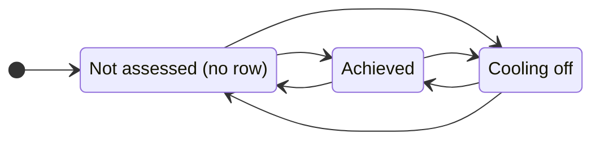
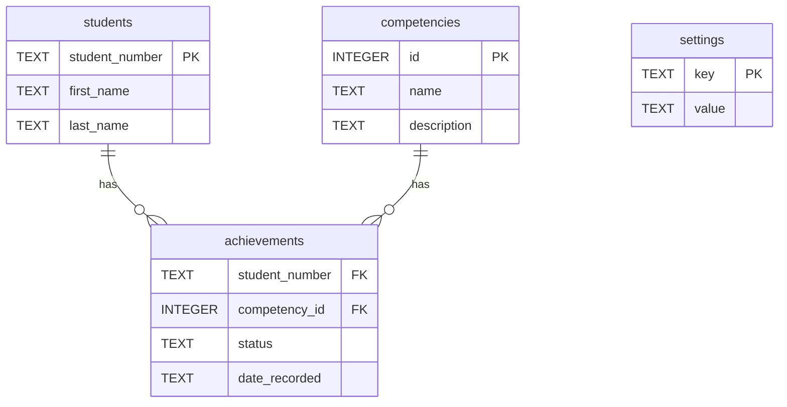

# Competencies App

A Flask web app for tracking student competencies in a competency-based course.
Students demonstrate competencies in lab; instructors and TAs record them in real
time. No lectures, assignments, or exams.

## Quick start

```
source venv/bin/activate
flask --app app run --debug --port 8080
```

Open `http://127.0.0.1:8080/` (the home page lists the students). Flask lives in
the virtualenv, so the activate step is required. `--debug` gives auto-reload and
full error pages. Port 8080 avoids the macOS AirPlay conflict on 5000.

Rebuild the database from scratch (it is fully reproducible from the two `.sql`
files):

```
sqlite3 course-data.db < schema.sql
sqlite3 course-data.db < seed.sql
```

## What it does

Three pages:

- **Home** (`/`): roster of students, each linking to mark or view them.
- **Staff view** (`/mark/<student_number>`): three buttons per competency (Not
  assessed / Achieved / Not passed). One tap sets the state and saves, no save
  button. Any TA or instructor can mark any student.
- **Student view** (`/view/<student_number>`): read-only progress, each
  competency shown as a colored status pill.

## Competency states

Each competency is in one of three states per student: **Not assessed** (no record
yet), **Achieved**, or **Cooling off** (attempted, did not pass). The staff button
for the last one reads "Not passed" (the action being recorded); the student view
shows it as "Available to retry" (with the time remaining).



Cooling off spaces out re-attempts. The cooldown is 48h from the recorded time,
and the student view shows the time remaining ("Cooling off (Nh left)"), computed
live from `date_recorded`. This is display only: enforcement (blocking a
re-attempt during the window) is not built yet, pending the exact rule.

## Architecture

- **Backend:** Python / Flask. **Database:** SQLite.
- **HTML:** custom `myHTML` classes (`myhtml.py`), where each tag is a subclass of
  one `element` class and `str()` recurses to emit markup.
- **Production:** runs under Apache via `mod_wsgi`, with TMU CAS auth
  (`mod_auth_cas` sets a `Cas-User` header). In development the CAS user is
  hardcoded, so no Apache, CAS, or VPN is needed.

### Tap-to-save flow


The button changes color only after the save succeeds, so the screen always
matches the database.

## Data model

Schema and seed data live in `schema.sql` and `seed.sql`.



A row in `achievements` exists only for a recorded event; `status` is
`'achieved'` or `'cooling_off'`, and "not assessed" is the *absence* of a row
(derived at read time). `date_recorded` is a full timestamp, so the cooldown is a
single elapsed-time comparison. The composite primary key is (`student_number`,
`competency_id`). `settings` holds config such as admin usernames.
