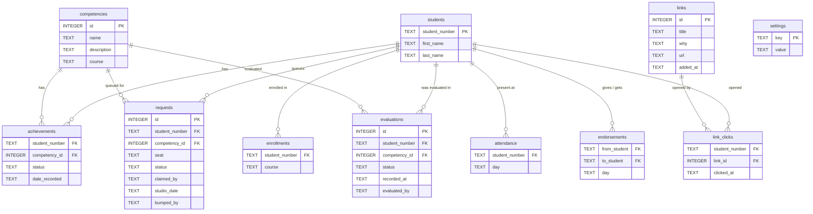

# Competencies App

A Flask web app for a competency-based studio at TMU (Fall 2026) that runs two
first-year courses together: **CPS109** (Python) and **CPS213** (digital logic).
There are no lectures, assignments, or exams. Instead, students demonstrate
competencies one-on-one to a TA in the lab, and the app coordinates that: students
sign up for what they are ready to show, TAs work a live queue, and results are
recorded in real time.

Each course has 40 competencies, and a few simple rules keep the studio fair and
moving.

## What it does

- **Live evaluation queue.** Students sign up for the competencies they are ready to
  show and take a seat when they arrive. TAs work the waiting list, claim a student,
  and mark each competency **Achieved**, **Not passed**, or **Not assessed** on the
  spot, one tap.
- **Balanced progress across both courses.** Each session a student can sign up for a
  few competencies (a cap), kept balanced between CPS109 and CPS213 so nobody races
  ahead in one course and neglects the other.
- **Carried-over competencies.** If a TA is not the right person to evaluate
  something, they tap **"Can't evaluate"** and it carries over to the student's next
  session instead of being lost or counted as a fail.
- **Studio sessions with book-ahead.** The studio meets Tuesday, Wednesday, and
  Thursday. A student can sign up for today's session or book a future one.
- **Pace against the studio.** A student's progress page opens with two bars: how much
  of their competency list is done, and how much of the studio has happened. Sessions,
  not calendar days, so reading week cannot make anyone look behind. The wording is a
  nudge in both directions, never a failure.
- **Who evaluated whom.** Every evaluation records the TA who did it, and a staff page
  shows the counts. A student who fails on Tuesday and passes on Thursday counts for
  both TAs, because both did the work.
- **Seat entry restricted to the lab.** Typing a seat number is the one action that
  requires being physically in the studio, checked by reverse DNS on the request.
  Everything else works from anywhere. Taking a seat is also what records attendance,
  and a TA can set a student's seat for them when that check gets in the way.
- **Worth reading.** The instructor curates short links, shown on the student progress
  page. Click-throughs are recorded per student, so it is possible to see who has read
  nothing and encourage them. Nothing here is graded.
- **Peer shout-outs.** A student can thank a classmate who helped them, and staff see
  a tally.
- **Per-course enrollment.** Students only see and sign up for the courses they are
  actually enrolled in.

## How I know it works

- **181 automated tests** covering the queue, sign-up rules, attendance, shout-outs,
  enrollment, the pace maths, evaluator tracking, the lab check and schema migrations.
  They run in about two seconds (`python -m pytest tests/`).
- The tests aim at the parts that actually break: two TAs claiming the same student at
  the same instant, retry timing across weekends and reading week, a retry crediting
  both TAs, and the lab check when DNS fails.
- **Every change goes through a pull request before it is merged**, with the reasoning
  for each decision written in the description.
- Worth being honest about the limit: tests are written by the person who built the
  thing, so they share that person's blind spots. The two worst problems found so far,
  a student identity bug and a config that would have locked every TA out, were both
  caught by asking "what happens on day one" rather than by any test.

## Quick start

**First-time setup** (clone, then from the repo root):

```
python3 -m venv venv              # create the virtualenv
source venv/bin/activate          # activate it (every new shell)
pip install -r requirements.txt   # install Flask
sqlite3 course-data.db < schema.sql   # build the database structure
sqlite3 course-data.db < competencies.sql   # the real 80 competencies
sqlite3 course-data.db < seed.sql           # sample students, LOCAL ONLY
```

**Run the app** (the day-to-day command):

```
source venv/bin/activate
flask --app app run --debug --port 8080
```

Open `http://127.0.0.1:8080/`. `--debug` gives auto-reload and full error pages.
Port 8080 avoids the macOS AirPlay conflict on 5000. The database is a file
(`course-data.db`) and persists between restarts; you only re-run the two
`sqlite3` commands to wipe and rebuild it (e.g. after a schema change).

**Dev logins.** There is no password in development, since CAS replaces this later.
On `/login`, type one of the seeded usernames:

| Type this | Signs in as |
|-----------|-------------|
| `dmason` | staff (lands on the evaluation queue) |
| `lfortune` | staff. Sign in as a *second* TA in a private window to watch queue claiming: a student claimed by `dmason` disappears from `lfortune`'s queue. |
| `600990517` | student Priya Singh |
| `500880917` | student Sarah Hassan |
| `500111111` | student Alice Chen |
| `500222222` | student Ben Okafor |
| `500333333` | student Chloe Diaz |

**Run the tests.** From the repo root with the venv active:

```
python -m pytest tests/
```

## How it's built

Python / Flask backend, SQLite database. The code is split by responsibility so
each file has one clear job:

| File | Responsibility |
|------|----------------|
| `app.py` | `create_app()` app factory: builds the app and registers the blueprints. |
| `blueprints/auth.py` | sign in / sign out. |
| `blueprints/main.py` | roster home and student progress pages. |
| `blueprints/mark.py` | staff marking page and per-tap save. |
| `blueprints/queue.py` | the evaluation queue routes (sign-up + staff marking). |
| `blueprints/queue_views.py` | builds the queue's pages (student view, staff queue, evaluation screen). |
| `common.py` | helpers shared across blueprints (current user, page header). |
| `logic.py` | pure rules: competency states, the retry cooldown, studio sessions, and the balance rule. No Flask/DB/HTML. |
| `db.py` | all data access: the `db.cursor()` context manager and every query. |
| `myhtml.py` | HTML elements as Python classes; `str()` renders the markup. |
| `migrate.py` | applies pending schema migrations to a live database, taking a dated backup first. |
| `migrations/` | one numbered SQL file per schema change. `schema.sql` builds a new database, these carry an existing one forward. |

A request flows: a **blueprint route** asks **`db.py`** for data and **`logic.py`**
for rule answers, builds the page with **`myhtml.py`**, and returns the HTML.

**Production:** runs under Apache via `mod_wsgi` with TMU CAS login, at
`https://admin.cs.torontomu.ca/studio1`. In development the login is a simple
placeholder, so no Apache, CAS or VPN is needed. See `DEPLOYMENT.md` for the setup.

## Data model

Schema lives in `schema.sql`. The real competency list is `competencies.sql`, which production loads. `seed.sql` is sample students and results for local work only, and must never be loaded on a real deployment (#92).



`achievements` holds the **current state** of a competency, one row per student, replaced
when they retry. `evaluations` is the **record of events**, one row per evaluation that
happened, never overwritten. The two answer different questions: where a student stands
comes from the first, how much evaluating a TA has done comes from the second. Counting
work from `achievements` would erase the TA who marked a failed first attempt.

`requests` is the evaluation queue. The rest link students to courses, attendance, peer
thank-yous and the reading list.
